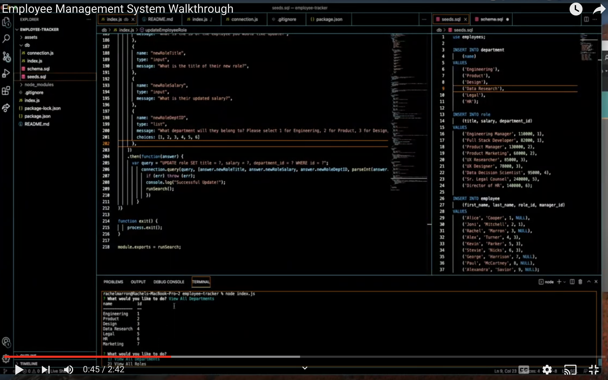
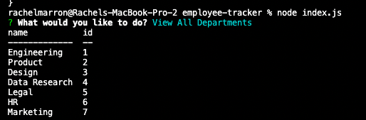
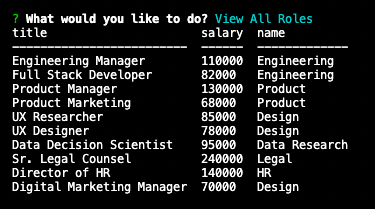
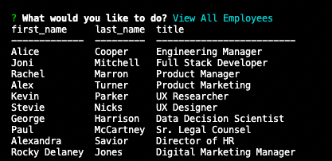
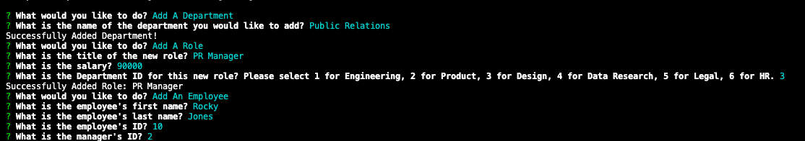
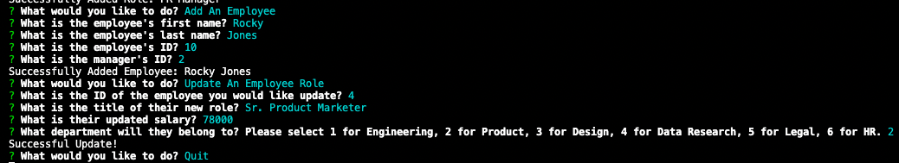

# Employee Management System (EMS)

## Link to deployed application 
Video Walkthrough: <a href="https://www.youtube.com/watch?v=6DQQxOzwqbg">https://www.youtube.com/watch?v=6DQQxOzwqbg</a>

## Overview 
Using Node.js, Inquirer, and MySQL, I created an employee managment system that can be run on the command line to view the database containing employee, department, and role information. Users are also able to update the tables my adding or updating employee role information.

## Summary of My Task & User Story 
This assigment had a user story of: AS A business owner 
I WANT to be able to view and manage the departments, roles, and employees in my company 
SO THAT I can organize and plan my business

The Acceptance Criteria included: 
<ul><li>WHEN I start the application</li>
<li>THEN I am presented with the following options: view all departments, view all roles, view all employees, add a department, add a role, add an employee, and update an employee role</li>
<li>WHEN I choose to view all departments, roles, or employees</li>
<li>THEN I am presented with the job title, role id, the department that role belongs to, and the salary for that role</li>
<li>WHEN I choose to add a department, role, or eomployee</li>
<li>THEN I am prompted to enter relevant data such as the name, salary, department ID, or salary.</li>
<li>WHEN I choose to update an employee role</li>
<li>THEN I am prompted to select an employee to update and their new role and this information is updated in the database</li>
</ul>

## How This Was Acheived
<ul>
<li>I installed inquirer, mysql2, and console.table packages</li>
<li>I created 2 databases using SQL. Schema.sql houses the table format and allows the users to use the database. Seeds.sql houses all the specific data of each table.</li>
<li>I created index.js files that, when run, prompts the user to add or update data on the commmand line</li>
  </ul>

## Visual Representation 

View all departments: 

 View all roles: 

  View all employees: 

 Add a department, role, and/or employee: 

 Update an existing employee: 

## Contributors

- Special thanks to my outside tutor, Jordan Hessler, (a former bootcamp graduate) who assisted me in fixing bugs in my application.

## License

This application is covered under MIT License    

- - -

© 2021 Rachel Delaney Marron, Inc. All Rights Reserved.
